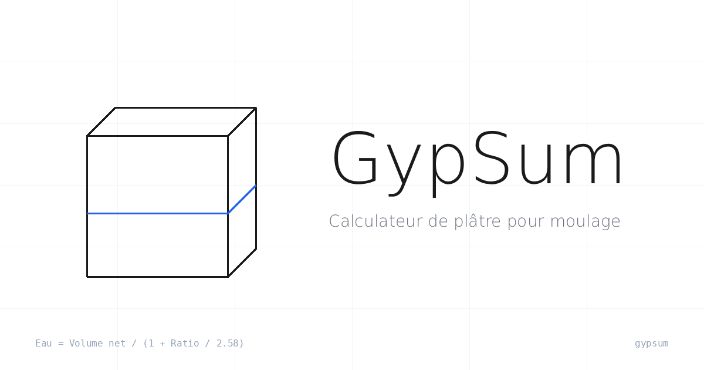

# GypSum

[](https://cedric-ruiu.github.io/gyp-sum/) [](https://vuejs.org/) [](https://vitejs.dev/) [](https://www.typescriptlang.org/) [](https://tailwindcss.com/) [](https://threejs.org/) [](LICENSE) [](https://cedric-ruiu.github.io/gyp-sum/)

👉 [https://cedric-ruiu.github.io/gyp-sum/](https://cedric-ruiu.github.io/gyp-sum/)

---

## What is it?

**GypSum** is a precision plaster calculator for mold making. It computes the exact water and plaster quantities needed to fill a mold, based on the actual density of gypsum (2.58 kg/L) and the net volume between the mold and the object being cast.

No more guessing, no more wasted material. Just enter your mold dimensions, describe the object inside, set your mixing ratio and safety margin — GypSum does the math.

---

## Features

- **Mold configurator** — supports box and cylinder shapes, with per-dimension input
- **Object configurator** — supports box, cylinder, sphere, and half-sphere shapes, or direct volume entry
- **Mix parameters** — configurable plaster-to-water ratio and waste margin
- **Live 3D scene** — interactive wireframe preview of the mold and object, with orbit controls and auto-rotation
- **Precise formulas** — water and plaster amounts derived from gypsum density, not rule-of-thumb ratios
- **State persistence** — your inputs are saved in `localStorage` and restored on next visit
- **No installation** — runs entirely in the browser, no account or backend required

---

## How it works

GypSum uses the following formula, fixed and not user-configurable:

```
Net volume  = Mold volume − Object volume
Water       = Net volume / (1 + Ratio / 2.58)
Plaster     = Ratio × Water
```

The constant **2.58 kg/L** is the density of gypsum (plâtre de Paris). All dimensions are entered in centimeters; results are displayed in liters and kilograms.

---

## Tech stack

| Layer | Technology |
|---|---|
| Framework | Vue 3 — Composition API + `<script setup>` |
| Build | Vite 8 |
| Language | TypeScript 6 |
| Styling | Tailwind CSS v4 (`@tailwindcss/vite`) |
| 3D | Three.js + OrbitControls |
| i18n | vue-i18n 10 (French UI) |
| Linting | Biome 2.4 |
| Hosting | GitHub Pages (static SPA) |

---

## Local development

```bash
# Install dependencies
yarn install

# Start dev server
yarn dev

# Type-check + production build
yarn build

# Lint
yarn lint

# Auto-format (lint + organize imports)
yarn format
```

---

## Contributing

Issues and pull requests are welcome. If you spot a calculation error or want to add a new shape, open an issue first to discuss the approach.

---

## License

[MIT](LICENSE) — Cédric Ruiu
